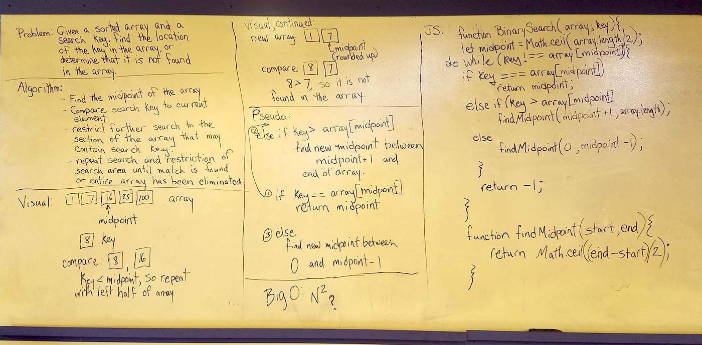

# Binary Search
Write a function to take in a sorted array and a search key. Find the location of the key in the array, or determine that it is not found in the array.

## Solution

Note: My best guess at Big O was N^2, and I knew that probably wasn't right (hence the question mark on my whiteboard notes) but we haven't covered very many Big O cases in class yet. Vinicio tells me it's logN.

