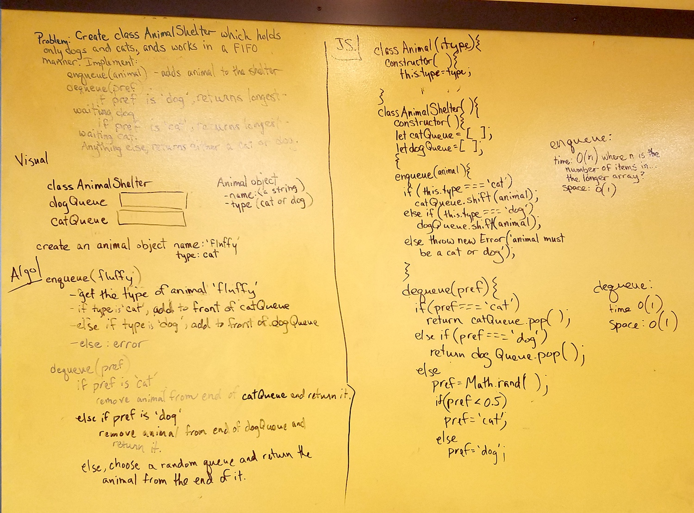

# FIFO Animal Shelter
Create a class called AnimalShelter which holds dogs and cats, and works in a first-in-first-out manner. Add an enqueue(animal) method to add an animal object to the shelter, and a dequeue(pref) method that returns the longest-waiting cat if passed 'cat' preference, longest-waiting dog if passed 'dog' preference, and either a dog or cat for any other preference.

## Solution

Notes:
I realize now that using arrays is not ideal, and Big O would be better if I had implemented the queues using linked lists. But I already had my array solution almost done, so I finished it. Also, when there is no cat/dog preference, since returning the longest-waiting animal was a stretch goal, not a requirement, I chose to return a dog or cat randomly. Testing this random functionality was tricky. I followed a suggestion I found here: 

https://stackoverflow.com/questions/41570273/how-to-test-a-function-that-output-is-random-using-jest?utm_medium=organic&utm_source=google_rich_qa&utm_campaign=google_rich_qa

It required temporarily reassigning the global Math object. This causes a red line in the code like a linter error, but it still passes running `eslint`. 

