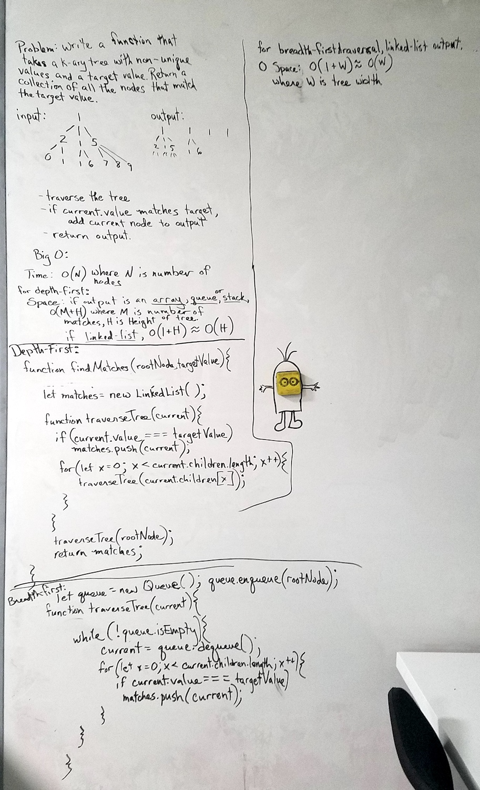

# Find Matches
Write a function that takes a k-ary tree with non-unique values and a target value. Return a collection of all the nodes that match the target value.

## Solution
Notes: My first solution was using a depth-first traversal, and I did it again with a breadth-first traversal just to see which one I liked better. I don't have a clear favorite.

